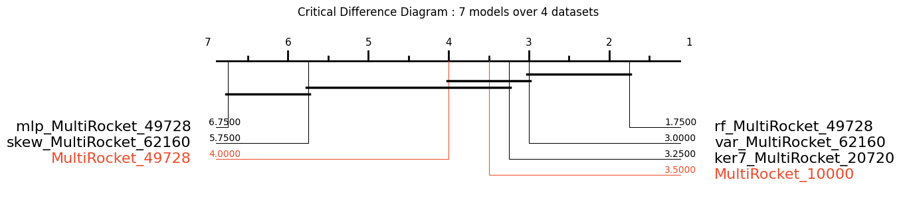

# MultiRocket — Time Series Classification

MultiRocket is a Python project implementing variations of the Rocket family for classification tasks. 

## Current repo

This GitHub repository is a coursework project for UCD Time Series module.

## Original work & Acknowledgements

This repository uses the [ChangWeiTan/MultiRocket](https://github.com/ChangWeiTan/MultiRocket.git) GitHub repository, which contains scripts, utilities, dataset indices and small helpers to run, reproduce, and evaluate experiments on univariate and multivariate time-series classification benchmarks.

*Preprint*: [arxiv:2102.00457](https://arxiv.org/abs/2102.00457)

## Code 

The [main_ucr.py](main_ucr.py) file contains a simple code to run the program on a single UCR dataset.

The [main_ucr_109.py](main_ucr_109.py) file runs the program on all 109 UCR datasets.

The [main_mtsc.py](main_mtsc.py) file contains a simple code to run the program on a single [MTSC](http://timeseriesclassification.com/dataset.php) dataset.
```
Arguments:
-d --data_path          : path to dataset
-p --problem            : dataset name
-i --iter               : determines the resample of the UCR datasets
-n --num_features       : number of features 
-t --num_threads        : number of threads (> 0)
-s --save               : 0=don't save results, 1=save results
-v --verbose            : verbosity
``` 

## Getting started

Prerequisites : `Python 3.8+ (tested on 3.12)`

Install dependencies : 

```bash
pip install -r requirements.txt
```

## Modification

Because we implemented this project on `Python 3.12` with `NumPy 1.26`, we had to modify the `main_ucr.py` file (and its variants) on the line 138 : 

```python
# Before
data=np.zeros((1, 21), dtype=np.float)

# After
data=np.zeros((1, 21), dtype=float)
```

## Quick run (example)

Run the program on a single UCR dataset [Beef](data/sample/Beef).

```bash
python main_ucr.py -d data/sample/ -p Beef -n 10000 -v 2
```
Arguments explanation :
- The path to the dataset (-d) is `data/sample/`
- The dataset name or problem (-p) is `Beef`
- The number of features (-n) we choose `10000` (default is 50000)
- The verbosity (-v) we choose `2` (it's easier to follow the steps and debug) 

## Outputs

After the runs, the raw experiment outputs are written in the [output](output/) folder.  
You will find per-resample CSVs, aggregated results and timing logs.

## Run our experimentations

Our goal is to suggest ideas to improve MultiRocket.

Look at our [results](improvements/Results.ipynb) file.

To reproduce our experimentation, run the following lines over these 4 datasets : 

- `InsectWingbeatSound`
- `StarLightCurves`
- `ElectricDevices`
- `Crop`

```bash
python main_ucr.py -d data/sample/ -p InsectWingbeatSound -n 10000 -v 2

python main_ucr.py -d data/sample/ -p InsectWingbeatSound -n 49728 -v 2

python main_ucr_var.py -d data/sample/ -p InsectWingbeatSound -n 62160 -v 2

python main_ucr_skew.py -d data/sample/ -p InsectWingbeatSound -n 62160 -v 2

python main_ucr_mlp.py -d data/sample/ -p InsectWingbeatSound -n 49728 -v 2

python main_ucr_rf.py -d data/sample/ -p InsectWingbeatSound -n 49728 -v 2

python main_ucr_ker7.py -d data/sample/ -p InsectWingbeatSound -n 20720 -v 2
```

## Results

The following results compare our 7 models across 4 selected datasets from the [UCR Time Series Classification Archive](https://www.cs.ucr.edu/~eamonn/time_series_data_2018/) (out of 109 available).

<p align="center">
  
</p>

## Authors 

- Axel Marchand (25262999)
- Edward Mallia (25233259)
- Aisling Wallace (25257061)

## Reference

```bibtex
@article{Tan2021MultiRocket,
  title={{MultiRocket}: Multiple pooling operators and transformations for fast and effective time series classification},
  author={Tan, Chang Wei and Dempster, Angus and Bergmeir, Christoph and Webb, Geoffrey I},
  year={2021},
  journal={arxiv:2102.00457}
}
```